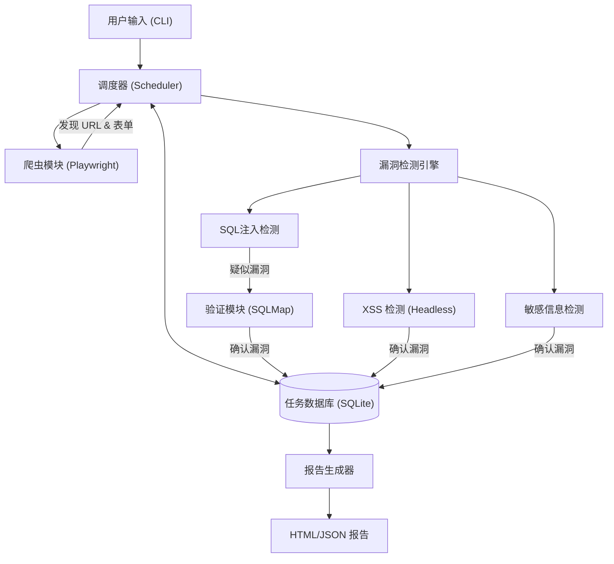

# Web 应用漏洞扫描器 - 产品规格说明书

## 1. 项目概述
本项目旨在开发一款自动化的 Web 应用漏洞扫描器，能够对目标 URL 进行爬取、分析，并检测常见的 Web 安全漏洞（如 SQL 注入、XSS 等）。项目强调对现代 Web 应用（SPA）的支持、扫描任务的可恢复性以及漏洞验证的自动化。

## 2. 功能清单 (Feature List)

### 2.1 核心功能 (MVP - Minimum Viable Product)
- **高级 URL 爬取 (Advanced Crawler)**:
    - **SPA 支持**: 集成 **Playwright**，通过 Headless 浏览器执行 JavaScript，确保完整抓取动态渲染的页面链接。
    - **资源过滤**: 自动排除静态资源 (css, jpg, png 等)，聚焦业务逻辑接口。
    - **表单提取**: 自动识别并解析 HTML 表单参数，为后续 Payload 注入做准备。

- **漏洞检测与验证 (Scanner & Verifier)**:
    - **SQL 注入 (SQLi)**:
        - 基础检测：报错注入、布尔盲注、时间盲注。
        - **自动验证**: 集成或调用 **SQLMap** API 对疑似漏洞点进行深度验证，确认漏洞真实性。
    - **跨站脚本 (XSS)**: 反射型 XSS 检测 (Payload 发送与 Headless 浏览器回显匹配)。
    - **敏感信息泄露**: 检测 `.git/`, `.env`, 备份文件等常见泄露路径。

- **任务管理 (Task Management)**:
    - **持久化与恢复**: 使用 SQLite/JSON 文件实时保存扫描进度（已爬取的 URL、已检测的漏洞）。支持中断后从断点继续扫描 (Resume Capability)。
    - **状态监控**: 实时输出扫描进度、当前 URL、发现漏洞数。

- **报告生成 (Reporter)**:
    - HTML 格式报告：包含漏洞详情、复现步骤、HTTP 请求/响应包。
    - JSON 格式输出：便于与其他安全工具集成。

### 2.2 进阶功能 (V2.0)
- **本地靶场集成**: 提供基于 Docker 的本地测试环境（如 DVWA, sqli-labs），用于自动化测试扫描器的准确性。
- **并发控制**: 基于 `asyncio` 的高并发扫描，支持速率限制 (Rate Limiting) 以防被 WAF 封锁。
- **认证扫描**: 支持 Cookie/Token 预配置，扫描需登录的后台页面。

## 3. 技术栈方案 (Python)

- **语言**: Python 3.10+
- **网络请求 & 爬虫**:
    - `Playwright for Python`: 核心爬虫引擎，处理 SPA 和动态页面。
    - `httpx`: 用于轻量级的 API 探测和 Payload 发送（比浏览器更高效）。
- **并发模型**: `asyncio` (原生异步 IO)，配合 Playwright 的异步 API。
- **数据存储**: `SQLite` (推荐) 或 `TinyDB`，用于存储任务状态和结果，实现断点续传。
- **CLI 框架**: `Typer` (构建现代化的命令行界面)。
- **外部工具集成**:
    - `sqlmap`: 通过子进程或 API 调用进行 SQL 注入深度验证。
    - `docker`: 用于编排本地测试靶场。

## 4. 架构设计 (Architecture)

### 关键流程说明
1.  **初始化**: 用户输入目标 URL，调度器初始化任务数据库，若存在历史记录则询问是否恢复。
2.  **爬取**: Playwright 启动浏览器，加载页面，执行 JS，提取所有 `<a>`, `<form>`, API 请求。
3.  **调度**: 提取的 URL 去重后存入数据库，分发给扫描模块。
4.  **检测**: 
    - 快速扫描：使用 `httpx` 发送轻量级 Payload。
    - 深度验证：对疑似 SQL 注入点，调用 `sqlmap` 进行确认。
5.  **保存**: 每一步的状态变更（URL 状态、漏洞发现）实时写入 SQLite，确保不丢失进度。

## 5. 开发计划 (Roadmap)
1.  **Phase 1: 核心框架与持久化**: 搭建项目骨架，实现基于 SQLite 的任务队列和状态管理。
2.  **Phase 2: Playwright 爬虫**: 实现支持 SPA 的动态爬虫，能够提取链接和表单。
3.  **Phase 3: 漏洞检测与验证**: 开发 SQLi/XSS 插件，并实现 SQLMap 的自动调用逻辑。
4.  **Phase 4: 报告与测试**: 生成标准化报告，并编写 Docker Compose 文件部署本地靶场进行自测。
